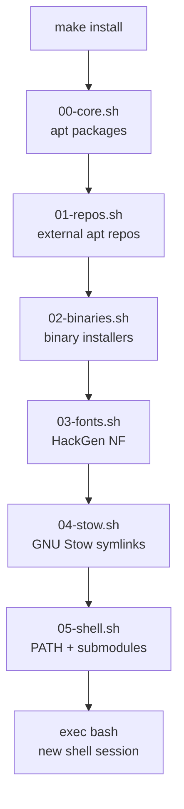

# Diagrams

This directory is for architecture and flow diagrams.

---

## Recommended diagrams

| Filename | Description |
| --- | --- |
| `install-flow.svg` | Installation phase flow diagram |
| `stow-linking.svg` | How GNU Stow creates symlinks |
| `repo-structure.svg` | Repository structure overview |

---

## Creating diagrams

Diagrams can be created with any of the following tools:

- [Excalidraw](https://excalidraw.com) — hand-drawn style (export as SVG)
- [draw.io](https://draw.io) — professional flow charts (export as SVG)
- [Mermaid](https://mermaid.js.org) — inline diagrams in Markdown

### Mermaid example (install flow)

---

## Committing diagrams

SVG files are preferred over raster formats because they scale to any size
and remain lightweight in the repository.

Binary formats (PNG, PDF) are acceptable for screenshots or exports from tools
that do not support SVG.
